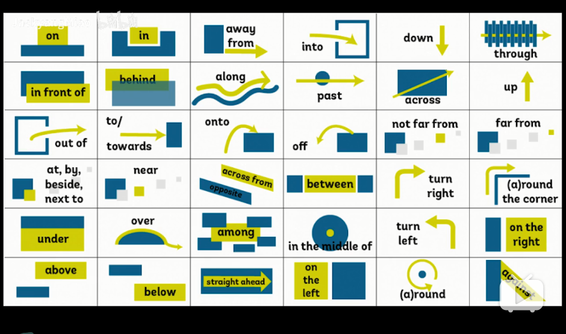

## 介词

连接各种各样的成分

|    |   |   |   |   |   |
|  ----  | ----  | ----  | ----  | ----  | ----  |
| on | in | away from | into | down | through | 
| in front of | behind | along | past | across | up | 
| out of | to,towords | onto | off | not far from | far from |
| at,by,beside,next to | near |across from |between| turn right | corner|
| upder | over | among | in the middle of | turn left | right |
| above | below | straight ahead | left | round | against | 

### 在句子中的用法
```
1. 定语: The method of success（成功的方法）
2. 状语: She lives in Vancouver （她住在温哥华）
3. 表语： It is in the right screw. （它 是一个正确的螺丝）
4. 宾补: He put he cellphone on the desk.（他把手机放在桌子上）
5. 同位语: As a doctor, he is responsible for his patinet. (他作为医生, 他对他病人负责)
```
### 介词搭配
```
介词+名词: for your car

介词+代词: with her

介词+动名词: for coming here

介词+副词: since then

介词+动词: of winning

介词+不定式: to make him angry

介词+从句: at which | fell asleep was very boring

介词+ 数词: over 100 people

介词+介词: just before us

```
## 介词分类

### 结构来分
```
单个介词: at、in、of、after...
合成介词: into、inside、outside...
分词介词: include、considering..
短语介词: in front of 、accord to ...
```
### 按词义分
```
地点、方向、时间、方式、涉及、目地、原因、比较、伴随
```


### 易混介词
1. 地点on 、 in 、at
```
at: 某个具体位置、加小地点
At bus station (在公交车站)
At No.12 avenue (在12大街)

in: 后面跟大地点
In Beijin（在北京）

on: 表示在上面,后面加楼层
On the 1 th floor (在一楼)
```
2. 时间 on、in 、at
```
at: 后面跟具体的时刻，一天中的具体时间点，具体的周和节日
At midnight（在午夜）

on: 后面跟具体的时间, 某年某月某日星期几
On Monday September 2th 2019 (在2019年9月2日星期一)

in: 后面跟年、月、早晚、季节、一段时间，将来时中表示一段时间之后 In Spring(在春天)
We will meet in a few days.(我们将在几天后见面)
```
3. 方位on、in、to
```
in: 是a在b里面
Kuming lies in the southwest of China. (昆明位于中国西南部)

on: 是a和b连着
Canada lies on the north of American. (加拿大位于美国北部)

to: 是a和b不连着
Japan lies to the east of China.(日本位于中国东部)

to: 表示方向
to the south (向南边)

on: 表示左右
on the left（向左边）
```
4. 时间after、in
```
after+具体时刻或者从句: 表示在什么时刻之后，跟一般时态
I was always playing football after school. (我放学后总是踢足球)

in+一段时间: 表示在多久之后，跟将来时态
We will study math in a new semester. (我们将在新学习学习数学)
```
5. 时间since、for
```
since+具体时刻或者从句: 自从什么时候起,一直到现在
Since Ford died, that's all changed. (自从福特死了,这一切都变了)

for+一段时间: 总共有多长之久
The school history for two  hundred years. (这学校历史长达200年)
```
6. in the front of 、in front of
```
in front of : 表示在某物范围外的前面
The is a tree in front of the school.（学校前面有一个课树）

in the front of: 表示在某物范围内的前面
We sit in the front of the bus.（我们坐在公交车的前面）
```
7. by、in、with
```
by: 乘坐交通工具、以什么方式
I have to go by bus.(我不得不坐公交车去)

in: 使用某种语言文字
He has a speech in English today. (他今天发表了一篇英文演讲)

with: 使用某种工具方法
Blending with Light.（光合作用）
```
8. through、across、over
```
through: 穿过、通过森林、人群、门等等
It passes through the Alataw Pass into Kazakstan

across 和 over 跨越、跨越过河流、街道、围墙

I run across the street.（我跑过马路）

```
9. under、below、beneath
```
under: 在...之下表示某物接触或者覆盖某物时
We finished the project in under a year. (我们在一年内完成了这个项目)

below: 某物低于某物、或者表示温度用
Below freezing.(冰点一下)

beneath: 在...之下（抽象概念）能力、地位、期望低
The game is beneath my expectations. (这游戏低于我的预期)
```

10. in、 into
```
in: 在...里面
I walk in the school.（我们在学校里走）

into: 朝着...里面去

I walked into the school. (我走进了学校)
```