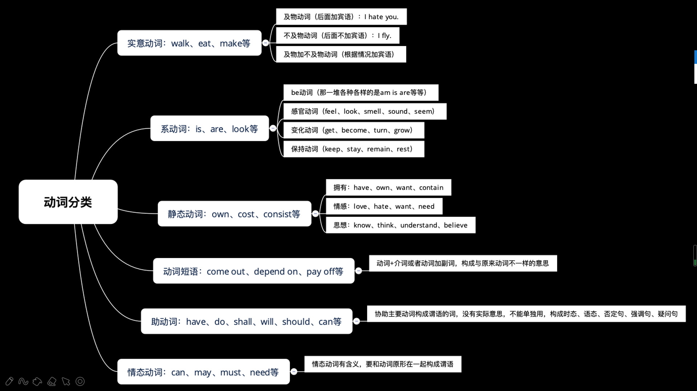

## 动词

### 能做谓语的
:::tip
1. 实意动词: walk , eat, make 等
2. 系动词: is , are , look 等
3. 静态动词: own, cost ,consist等
4. 动词短语: come out, depend on ,pay off等
:::

### 不能做谓语
:::tip
1. 助动词: have , do ,shall, wall, should, can 等
2. 情态动词: can , may , must , need 等
:::

<!-- > 实意动词 -->

#### 实意动词

::: tip
表示动词,及物动词(vt)和不及物动词(vi)

及物动词（后面加宾语）:I hate you.

不及物（后面布甲宾语）: I fly.

及物加不及物动词(根据情况加宾语)

I stop.(我停下)

I stop working (我停下工作)

不及物动词没有被动句, 因为它后面不能加宾语
:::

#### 系动词
> 系动词，引导表语或者表语从句
::: tip
be 动词(那一堆各种各样的是, am, is,are ,等等)

感官动词(feel, look, smell, sound , seem)

变化动词(get, become, turn, grow)

保持动词(keep, stay, remain, rest)

:::

#### 动词短语

> 动词+ 介词或者动词加副词，构成与原来动词不一样的意思
::: tip
动词+ about: think about
动词+ away： pass away
动词+ back： give back
动词+ for: care for
动词+ at: work at
动词+ from: hear from 
动词+ of: think of
动词+ out: carry out
动词+ in：cut in
动词+ into: look into
动词+over：get over
动词+to: point to
动词+up: do up
动词+with: end with
动词+through: see through

add up to, look down on , make up for ,take pity on ,make use of
:::

#### 助动词
> 协助主要动词构成谓语的动词，没有实际的意思，不能单独用，构成时态，
语态，否定句，强调句，疑问句

::: tip
代表词，hava，do，be，如果不能翻译的意思就是助动词

hava 做助动词，构成完成时
I hava turned off the light（我已经吧灯关了）

do做助动词，构成疑问句，否定句，强调句
Do you hava kids?(你有孩子吗)
I do not work（我不知道）
Do come with you（一定要跟你去）

be动词做助动词。构成进行时或被动语态
I am wathing this video

:::

#### 情态动词
> 情态动词有含义，要和动词原形在一起构成谓语

::: tip
can/counld 表示推测，允许，能力
You can imagine the story is bod（你可以想象这个故事不好）
you could hava been hurt（你可能会受伤）

may/might表示推测，允许，请求，祝愿

It may rain today（今天可能下雨）

I might be the next lucky dog（我可能是一下个幸运儿）

be able to （能够）
have to（必须）
had better （最好）
:::

